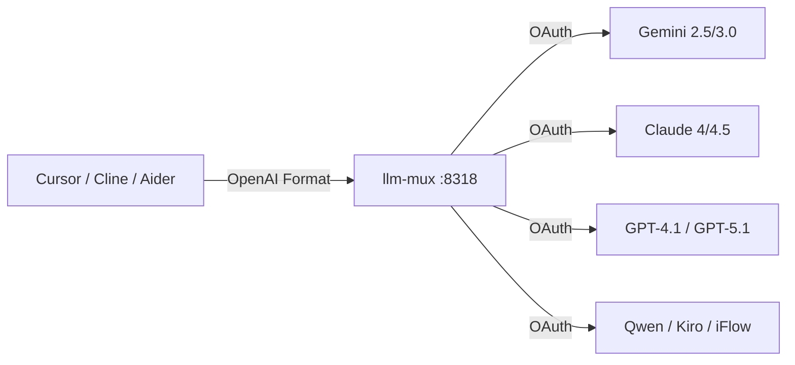

# llm-mux

[](https://opensource.org/licenses/MIT)
[](https://github.com/nghyane/llm-mux)
[](https://golang.org)

**Use Claude, Gemini, GPT-5, and Copilot for FREE.** A local AI gateway that lets you access premium AI models without API keys—just OAuth login.

> **Works with:** Cursor, Cline, Aider, Continue, Windsurf, VS Code, and any OpenAI-compatible tool.



## Why llm-mux?

| Problem | Solution |
|:--------|:---------|
| API keys cost $20+/month per provider | **Free** — uses OAuth from free tiers |
| Each tool needs different API format | **Universal** — one endpoint, all formats |
| Rate limits and quota errors | **Smart** — auto-retry, load balancing |
| Managing multiple accounts | **Unified** — all credentials in one place |
| Privacy concerns with API keys | **Local** — runs on your machine, keys never leave |

---

## ⚡️ Quick Start (30 seconds)

### Install

| OS | Command |
|:---|:---|
| **macOS / Linux** | `curl -fsSL https://raw.githubusercontent.com/nghyane/llm-mux/main/install.sh \| bash` |
| **Windows** | `irm https://raw.githubusercontent.com/nghyane/llm-mux/main/install.ps1 \| iex` |
| **Docker** | `docker run -p 8318:8318 -v ~/.config/llm-mux:/root/.config/llm-mux nghyane/llm-mux` |

### Setup

```bash
llm-mux --init           # Generate config + management key
llm-mux --login          # Login with Google (Gemini)
llm-mux --claude-login   # Login with Anthropic (Claude)
llm-mux --copilot-login  # Login with GitHub (GPT-4.1/5)
```

### Use

Point your AI tool to `http://localhost:8318` — that's it!

```bash
# Test it works
curl http://localhost:8318/v1/chat/completions \
  -H "Content-Type: application/json" \
  -d '{"model": "gemini-2.5-flash", "messages": [{"role": "user", "content": "Hello!"}]}'
```

---

## 🔌 Tool Integration

### Cursor
```
Settings → Models → OpenAI API Base URL → http://localhost:8318/v1
```

### Cline / Claude Dev (VS Code)
```
Settings → API Provider → OpenAI Compatible → http://localhost:8318/v1
```

### Aider
```bash
aider --openai-api-base http://localhost:8318/v1 --model gemini-2.5-pro
```

### Continue.dev
```json
// ~/.continue/config.json
{
  "models": [{
    "provider": "openai",
    "model": "claude-sonnet-4-20250514",
    "apiBase": "http://localhost:8318/v1"
  }]
}
```

### Python / LangChain
```python
from openai import OpenAI
client = OpenAI(base_url="http://localhost:8318/v1", api_key="unused")
response = client.chat.completions.create(
    model="gemini-2.5-flash",
    messages=[{"role": "user", "content": "Hello!"}]
)
```

---

## 🔐 All Providers

```bash
# Google
llm-mux --login              # Gemini (2.5 Pro/Flash, 3.0)
llm-mux --antigravity-login  # Google Cloud Code

# Anthropic  
llm-mux --claude-login       # Claude 4 Sonnet/Opus

# OpenAI / GitHub
llm-mux --codex-login        # OpenAI Codex CLI
llm-mux --copilot-login      # GitHub Copilot (GPT-4.1, GPT-5)

# Amazon
llm-mux --kiro-login         # Kiro / Amazon Q Developer

# Others
llm-mux --qwen-login         # Qwen (Alibaba)
llm-mux --iflow-login        # iFlow
llm-mux --cline-login        # Cline API
```

**Or use the Web UI:** `http://localhost:8318/v0/management/`

---

## 📊 Available Models

| Provider | Popular Models | Context |
|:---------|:---------------|:--------|
| **Gemini** | `gemini-2.5-pro`, `gemini-2.5-flash`, `gemini-3-flash`, `gemini-3-pro-preview` | 1M tokens |
| **Claude** | `claude-sonnet-4-20250514`, `claude-opus-4-5-20251101`, `claude-sonnet-4-5-thinking` | 200K tokens |
| **Copilot** | `gpt-4.1`, `gpt-4o`, `gpt-5`, `gpt-5.1-codex-max` | 128K tokens |
| **Qwen** | `qwen3-coder-plus`, `qwen3-coder-flash` | 128K tokens |

> Full list: `curl http://localhost:8318/v1/models`

---

## 🎯 API Endpoints

llm-mux speaks multiple API formats — use whichever your tool expects:

| Format | Endpoint | Compatible With |
|:-------|:---------|:----------------|
| **OpenAI** | `POST /v1/chat/completions` | Cursor, LangChain, most tools |
| **Claude** | `POST /v1/messages` | Claude Dev, Aider |
| **Gemini** | `POST /v1beta/models/:model:generateContent` | Google tools |
| **Ollama** | `POST /api/chat` | Ollama-compatible tools |
| **Responses API** | `POST /v1/responses` | OpenAI Responses format |

---

## ⚙️ Advanced Features

<details>
<summary><strong>🔄 Load Balancing & Quota Management</strong></summary>

Add multiple accounts per provider — llm-mux automatically:
- Rotates between accounts
- Retries on rate limits
- Tracks quota usage per account

```bash
# Add multiple Gemini accounts
llm-mux --login  # Account 1
llm-mux --login  # Account 2 (different Google account)
```

</details>

<details>
<summary><strong>🎛️ Management API</strong></summary>

```bash
# Get your management key
llm-mux --init

# List all credentials
curl http://localhost:8318/v0/management/auths \
  -H "X-Management-Key: YOUR_KEY"

# Start OAuth via API
curl -X POST http://localhost:8318/v0/management/oauth/start \
  -H "X-Management-Key: YOUR_KEY" \
  -d '{"provider": "claude"}'
```

</details>

<details>
<summary><strong>☁️ Sync Across Machines (GitStore)</strong></summary>

Sync credentials across devices using a private Git repo:

```bash
export GITSTORE_GIT_URL=https://github.com/you/llm-mux-store.git
export GITSTORE_GIT_USERNAME=your_user
export GITSTORE_GIT_TOKEN=your_pat_token
```

</details>

<details>
<summary><strong>🖥️ Service Management</strong></summary>

| Action | macOS | Linux | Windows |
|:-------|:------|:------|:--------|
| Start | `launchctl start com.llm-mux` | `systemctl --user start llm-mux` | `Start-ScheduledTask "llm-mux"` |
| Stop | `launchctl stop com.llm-mux` | `systemctl --user stop llm-mux` | `Stop-ScheduledTask "llm-mux"` |

</details>

---

## 🏗️ How It Works

```
Your Tool (OpenAI format)
    ↓
llm-mux (translate to IR)
    ↓
Provider API (Gemini/Claude/etc.)
    ↓
llm-mux (translate response back)
    ↓
Your Tool (OpenAI format response)
```

**Intermediate Representation (IR):** Instead of N² translations between formats, llm-mux uses an IR — translate to IR once, translate from IR once. 2N instead of N².

---

## 📝 Keywords

`free claude api` · `free gemini api` · `cursor free` · `ai proxy` · `openai compatible` · `llm gateway` · `claude without api key` · `gemini openai format` · `aider free` · `cline api` · `multi llm` · `ai aggregator`

---

## License

MIT License — see [LICENSE](LICENSE)

---

<p align="center">
  <b>⭐ Star this repo if llm-mux saves you money!</b>
</p>
