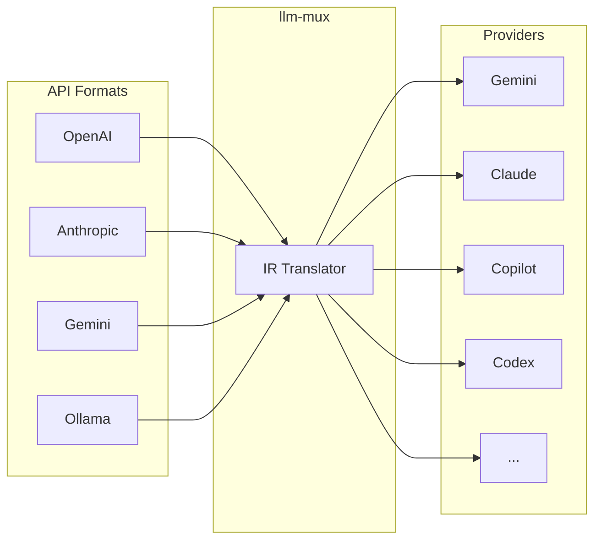

# llm-mux

**AI Gateway for Subscription-Based LLMs**

[](https://github.com/nghyane/llm-mux/releases)
[](https://github.com/nghyane/llm-mux/stargazers)
[](https://opensource.org/licenses/MIT)
[](https://hub.docker.com/r/nghyane/llm-mux)

Turn your Claude Pro, GitHub Copilot, and Gemini subscriptions into standard LLM APIs. No API keys needed.

## Features

- **Multi-Provider** — Claude, Copilot, Gemini, Codex, Qwen, Kiro, and more
- **Multi-Format** — OpenAI, Anthropic, Gemini, Ollama compatible endpoints
- **Multi-Account** — Load balance across accounts, auto-retry on quota limits
- **Zero Config** — OAuth login, no API keys required
- **Protocol Translation** — IR-based translator converts between all formats

## Quick Install

```bash
# macOS / Linux
curl -fsSL https://raw.githubusercontent.com/nghyane/llm-mux/main/install.sh | bash

# Windows (PowerShell)
irm https://raw.githubusercontent.com/nghyane/llm-mux/main/install.ps1 | iex
```

## Quick Start

```bash
# 1. Login to a provider
llm-mux --antigravity-login   # Google Gemini
llm-mux --claude-login        # Claude Pro/Max
llm-mux --copilot-login       # GitHub Copilot

# 2. Start the server (runs as background service after install)
llm-mux

# 3. Verify
curl http://localhost:8317/v1/models
```

## API Formats

| Format | Endpoint | Use With |
|--------|----------|----------|
| **OpenAI** | `/v1/chat/completions` | Cursor, Aider, LangChain |
| **Anthropic** | `/v1/messages` | Claude Code, Cline |
| **Gemini** | `/v1beta/models/{model}:generateContent` | Gemini CLI |
| **Ollama** | `/api/chat` | Open WebUI |

```
Base URL: http://localhost:8317
API Key:  unused
```

**OpenAI format:**
```bash
curl http://localhost:8317/v1/chat/completions \
  -H "Content-Type: application/json" \
  -d '{"model": "gemini-2.5-pro", "messages": [{"role": "user", "content": "Hello!"}]}'
```

**Anthropic format:**
```bash
curl http://localhost:8317/v1/messages \
  -H "Content-Type: application/json" \
  -H "anthropic-version: 2023-06-01" \
  -d '{"model": "claude-sonnet-4", "max_tokens": 1024, "messages": [{"role": "user", "content": "Hello!"}]}'
```

See [API Reference](docs/api-reference.md) for all endpoints.

## Documentation

| Guide | Description |
|-------|-------------|
| [Installation](docs/installation.md) | Install options, update, uninstall |
| [Providers](docs/providers.md) | All supported providers and login commands |
| [Configuration](docs/configuration.md) | Config file reference |
| [API Reference](docs/api-reference.md) | Supported API formats and endpoints |
| [Integrations](docs/integrations/) | Cursor, VS Code, Aider, LangChain, etc. |
| [Docker](docs/docker.md) | Container deployment |
| [Service Management](docs/service-management.md) | Background service on macOS/Linux/Windows |
| [Troubleshooting](docs/troubleshooting.md) | Common issues and solutions |

## Supported Providers

| Provider | Login Command | Models |
|----------|---------------|--------|
| Google Gemini | `--antigravity-login` | gemini-2.5-pro, gemini-2.5-flash |
| Claude | `--claude-login` | claude-sonnet-4, claude-opus-4 |
| GitHub Copilot | `--copilot-login` | gpt-4.1, gpt-4o, gpt-5 |
| OpenAI Codex | `--codex-login` | gpt-5 series |
| Qwen | `--qwen-login` | qwen-coder |
| Kiro | `--kiro-login` | Amazon Q models |
| Cline | `--cline-login` | Cline API |
| iFlow | `--iflow-login` | iFlow models |

See [all providers](docs/providers.md) for details and model lists.

## Integrations

Works with any OpenAI/Anthropic/Gemini-compatible tool:

**Editors:** Cursor, VS Code (Continue, Cline, Roo Code), Zed, Neovim (avante.nvim)  
**CLI:** OpenCode, Aider, Claude Code, Codex CLI, Gemini CLI, Goose  
**Frameworks:** LangChain, LlamaIndex, Vercel AI SDK  
**Web UIs:** Open WebUI, LibreChat

See [integration guides](docs/integrations/) for setup instructions.

## Architecture



## License

MIT License — see [LICENSE](LICENSE)
